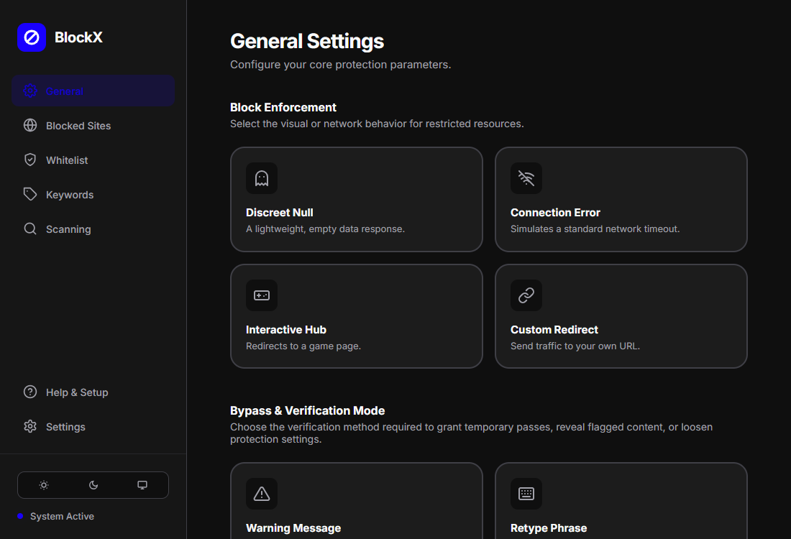
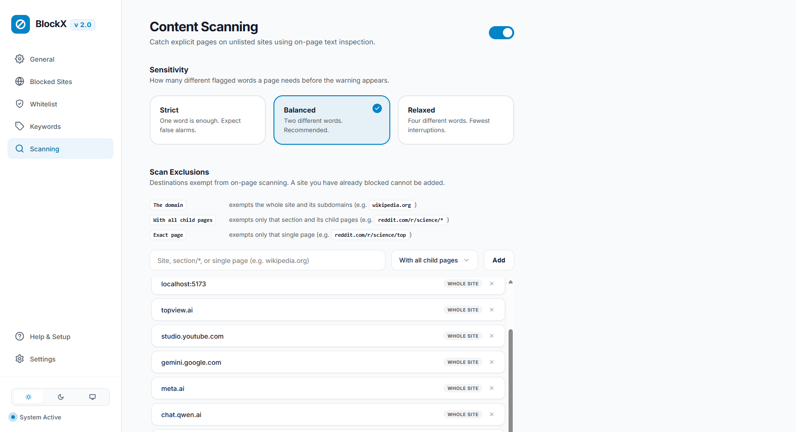
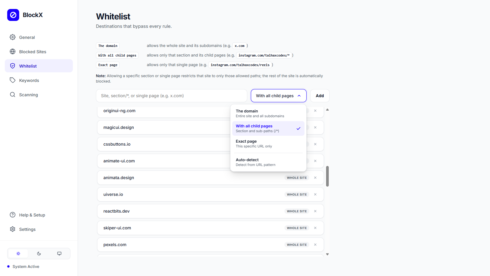
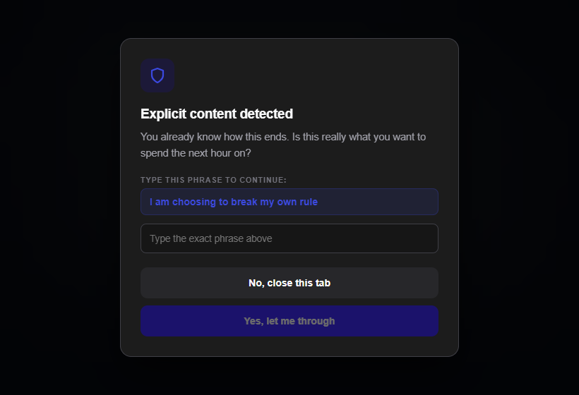
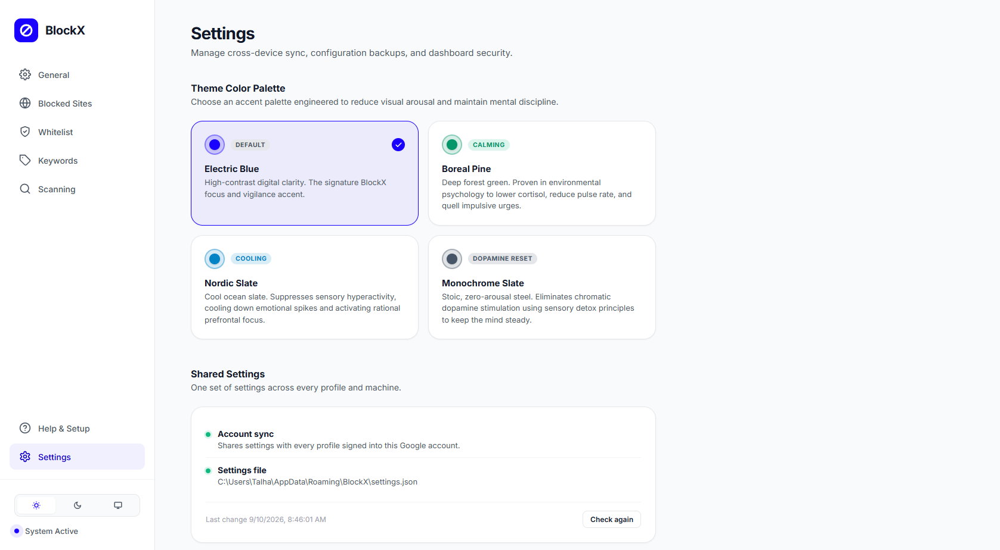

# BlockX v2

**A powerful, distraction-free content blocker built for discipline.**

---

## Features

- **Modern Interface**  
  Clean, polished dashboard and toolbar popup with full Light Mode and Dark Mode support.

- **Dual Bypass Modes**  
  Choose between a two-step confirmation Warning Message or a word-for-word Retype Phrase challenge.

- **Unified Blocked Sites**  
  Manage entire domains, path prefixes (`/*`), and exact URLs in one unified place.

- **Granular Whitelist**  
  Whitelist a specific page (such as a single profile or video path) while automatically keeping the rest of the site blocked.

- **Scoped Keyword Filtering**  
  Add keywords with custom checking scopes (URL plus page content, or page only).

- **Robust Content Scanner**  
  Real-time on-page scanner with word-boundary matching to prevent false positives, plus a master toggle to turn scanning on or off.

- **Custom Calming Themes**  
  Four scientifically designed color palettes (Electric Blue, Boreal Pine, Nordic Slate, and Monochrome Slate) with matching dynamic favicons.

- **All-in-One Help & Setup**  
  One-click Chromium browser lockdown policy generator for Incognito, Guest mode, and extensions protection.

- **Password Protection & Backup**  
  Secure your settings with a dashboard password, with quick JSON backup export and import.

---

## Installation

1. Download or clone this repository.
2. Open `chrome://extensions` in any Chromium browser (Chrome, Brave, Edge).
3. Enable **Developer mode** using the toggle in the top right.
4. Click **Load unpacked** and select the BlockX directory.

The dashboard opens automatically upon installation.

---

## Privacy First

BlockX does not collect, track, store, or transmit any data whatsoever.

- The extension runs entirely on your local machine.
- No analytics, no telemetry, and no tracking scripts.
- No external server connections. Everything stays completely on your side.

---

## Screenshots

### General Settings
Configure block enforcement behaviors, bypass verification modes, and your custom reflection prompts.

 

### Content Scanning
Manage keyword dictionaries with custom scopes (URL and page content, or page only) and toggle real-time DOM scanning.

 

### Granular Whitelist
Allow specific sections or single pages while keeping the rest of the domain blocked.

 

### On-Page Content Warning
Blocks explicit content in real time behind a overlay and requires your intention to proceed.

 

### Theme Palettes & Sync Settings
Switch between calming accent themes and manage cross-device synchronization.

---

## License

[PolyForm Noncommercial License 1.0.0](https://polyformproject.org/licenses/noncommercial/1.0.0) (see [LICENSE](LICENSE)). Free for personal, noncommercial use.
