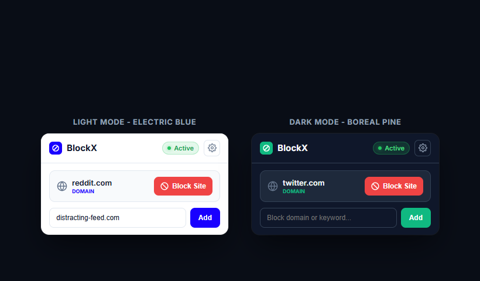
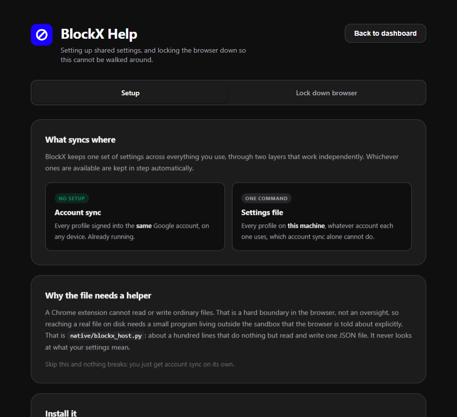

<div align="center">


# BlockX v2

**A content blocker built for the moment you want to turn it off.**

Anything can block a website. What makes BlockX different is that the ways out are slow, deliberate, and follow you across every profile on your machine.

[](https://developer.chrome.com/docs/extensions/mv3/intro/)
[](#install)
[](#architecture)
[](LICENSE)

<br>


</div>

---

## Why BlockX Exists

Most blockers fail the same way. Not because the filtering is weak, but because disabling them takes one click at the exact moment you have the least willpower.

BlockX is built on the opposite assumption: **you will try to get around it, and that friction is the part worth designing.**

| Common Escape Route | What BlockX Does Instead |
|---|---|
| Delete a site from the blocklist | Takes **12 minutes**, and only if you keep the dashboard open the whole time |
| Import an edited settings file | Held for 12 minutes unless you affirm your intention first |
| Hand-edit the settings file on disk | Loosening changes are ignored and the file is rewritten |
| Open a second profile or Incognito | A single policy command makes the **browser itself** refuse |
| Search for explicit terms instead of visiting | Queries are inspected and blocked before the search results load |
| Visit a site that is on no blocklist | The page text is scanned in real time and held behind a heavy blur barrier |
| Inspect element or flip disabled in DevTools | Authority lives in the background service worker, never in the DOM |

You set the rules and you own the machine. BlockX works because you want it to; it simply refuses to be easy in the wrong moment.

---

## Visual Showcase

### Quick Access Toolbar Popup
Clean, direct toolbar popup with one-click site blocking, an inline quick-add bar, and full Light Mode and Dark Mode support.

<div align="center">

</div>

<br>

### Protection Dashboard
Configure block enforcement modes, bypass verification methods, and select calming color palettes.

<div align="center">

</div>

<br>

### Browser Lockdown & Sync Setup
Generate native Chromium policies to close Incognito, Guest mode, and the extensions page.

<div align="center">

</div>

---

## Core Features

### 1. Multi-Layer Blocking Engine
- **Four independent layers**: Declarative Net Request rules, navigation listeners, SPA history hooks, and in-page scanning.
- **3,553 bundled domains** and **349 explicit keywords**, plus your custom domains, keywords, and path rules.
- **Deep search query inspection**: Intercepts queries across Google, Bing, DuckDuckGo, Yahoo, Yandex, Brave, Ecosia, YouTube, Reddit, and others.
- **Strict Host Whitelist**: Accepts domains, IPv4, IPv6, `localhost`, and container names with exact-match rules.
- **Forced SafeSearch**: Enforces SafeSearch across major search engines and strips YouTube Shorts.

### 2. Real-Time Content Scanner
- Pages that are not on any blocklist get scanned before content paints.
- Heavy backdrop blur barrier (30% dark fade and 50px backdrop filter) keeps unverified pages hidden.
- Word-boundary matching prevents false positives (e.g. `analysis`, `button`, `grapes`, and `cocktail` will not trip the scanner).
- Immediate capture-phase interception on inputs, search bars, and form submissions.

### 3. Intentional Friction & Bypass Modes
- **12-Minute Cooling-Off Period**: Any action that weakens protection triggers an unskippable 12-minute timer that voids if the tab is closed.
- **One-Time Visit Passes**: Retype an exact custom phrase to earn a single visit in one tab. Reloading or navigating away blocks it again.
- **Permanent User Blocks**: Domains you block manually never offer temporary bypasses.
- **Two-Step Reflection Warning**: Optional prompt requiring deliberate confirmation before proceeding.

### 4. Dynamic Calming Color Palettes
Scientifically grounded theme spectrums engineered to down-regulate sympathetic arousal:
- **Electric Blue**: High-contrast default for clarity and focus.
- **Boreal Pine**: Calming natural emerald green proven to lower cortisol.
- **Nordic Slate**: Cool cyan-slate spectrum quieting sensory hyperactivity.
- **Monochrome Slate**: Dopamine-neutral grayscale eliminating chromatic arousal cues.
- All themes include pre-computed SVG icons and zero-overhead dynamic browser tab favicons.

### 5. Multi-Profile & Multi-Device Sync
- **Account Sync**: Automatically synchronizes rules across every profile signed into the same Google account on any device.
- **Local Settings File**: An optional lightweight native helper (`native/blockx_host.py`) synchronizes rules across every browser profile on the machine regardless of Google account.
- Conflict resolution uses monotonic revision counters: the most recent change wins.

---

## Install

```
1. Download or clone this repository
2. Navigate to  chrome://extensions
3. Enable  Developer mode  (top right toggle)
4. Click  Load unpacked  and select the BlockX directory
```

The dashboard opens automatically upon first launch.

---

## Browser Lockdown

Extensions cannot close Incognito or prevent new profiles on their own; **browser policies** can.

BlockX includes a built-in policy generator under **Help & Setup -> Lock down browser**:

| Policy Option | What It Enforces |
|---|---|
| Turn off Incognito mode | Removes the Incognito option and shortcut completely |
| Turn off Guest mode | Prevents launching unmonitored guest profiles |
| Prevent adding profiles | Blocks creating new browser identities |
| Block the extensions page | **Makes BlockX stick** by preventing removal from `chrome://extensions` |
| Force Google SafeSearch | Enforces SafeSearch at the browser policy level |
| Turn off Developer Tools | Prevents using the DOM inspector on the security overlay |
| Block installing extensions | Stops unapproved proxy or unblocker extensions from being added |

Select your options, pick your operating system (Windows, macOS, or Linux), and run the single generated command in your terminal.

---

## Shared Settings Across All Profiles

To enforce settings across every profile on your computer without depending on a Google account:

```bash
cd native
python3 install.py
```

Settings are then maintained at:
- **Windows**: `%APPDATA%\BlockX\settings.json`
- **macOS**: `~/Library/Application Support/BlockX/settings.json`
- **Linux**: `~/.config/blockx/settings.json`

Every write is checksummed. Unsigned external edits that attempt to loosen protection are discarded automatically.

---

## Architecture

BlockX has **zero dependencies, no bundlers, and no build steps**. Load the directory directly into Chrome.

```
src/
  background.js       Background service worker: DNR rules, blocking logic, countdown engine
  content.js          Anti-flash barrier, real-time input interceptor, on-page scanner
  inject.js           Main-world hook for single page application route changes
  config.js           Shared filters, search engines, and keyword definitions
  icon-helper.js      Dynamic SVG icon generator and zero-overhead favicon switcher
  settings-sync.js    Reconciliation engine for local storage, sync, and native file
  options/            Full management dashboard and theme controls
  popup/              Compact toolbar dropdown popup
  help/               Setup documentation and browser policy generator
native/
  blockx_host.py      Native messaging host for cross-profile file persistence
  install.py          Automated installer for Chromium browsers
assets/
  icons/              Master SVG icon and high-resolution standard bitmaps
  screenshots/        Documentation screenshots
```

### Core Design Principles
1. **Authority stays in the service worker**: The DOM is untrusted. Every bypass, grant, and block decision is validated in the background process.
2. **Fail closed**: If a message fails, a file is unreadable, or a script errors, content stays blocked.

---

## Testing & Verification

Run the test suites with Node.js:

```bash
node --check src/background.js
node --check src/content.js
node --check src/popup/popup.js
node --check src/options/options.js
python3 -m py_compile native/*.py
```

---

## License

[PolyForm Noncommercial License 1.0.0](https://polyformproject.org/licenses/noncommercial/1.0.0) (see [LICENSE](LICENSE)).

Free to use, study, modify, and share for noncommercial purposes. Third-party lists and game assets remain under their respective licenses (see [CREDITS.md](CREDITS.md)).
